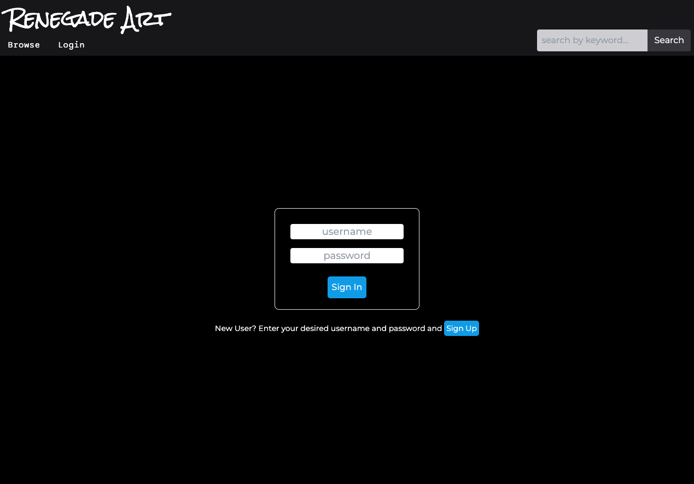
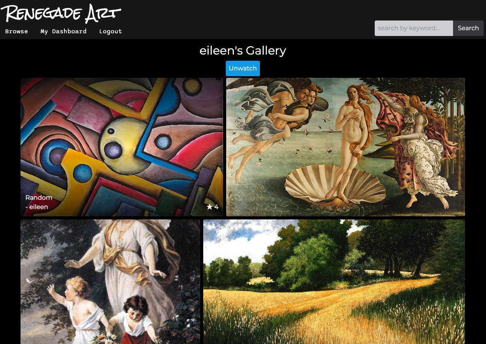

# Renegade Art

## Table of Contents

- [Description](#description)
- [User Story](#user-story)
- [Acceptance Criteria](#acceptance-criteria)
- [Languages](#languages)
- [Usage](#usage)
- [Deployed](#deployed)
- [Screenshots](#screenshots)
- [Contact](#contact)

## Description

Renegade art is a website where viewers of art can comment on peices, follow artist and like their art. For artist it is a place where art can be uploaded and displayed. The artist has an option to set keywords to their artwork for easy search by viewers, they can describe their art which is displayed as well. If they wish the art can be taken down or edited by the artist only, who must log in to edit their work and can only edit their own work aside from leaving comments and likes.
This project is another art website that can be used as an alternative to other bigger sites where artist would have more competition for views. We all learned through this project that even in back end developement that javascript in an invaluable tool and a majority of our site is made up of JavaScript. It really is the connective tissue and muscle that makes creates functions and executes them. Tailwind was used for most of the CSS, it was fun to work with and an easy alternative to Bootstrap.

## User Story:

As an user of the app
I want to have the option to add and purchase art pieces as well as comment on other piece of art.

## Acceptance Criteria

Given I visit the app
When I open the homepage
Then pieces of art work are presented to me.
When I click on each art piece
Then I am directed to the art piece page with more information including artist, art description, likes and other people's comments about the peice.
When I click login/sign up buttons
Then I am guided to a page where I can create an account or login so that I can add, delete or edit art pieces and the coinciding information.  
When I click comment button in the art piece page,
Then I can post my comment about the art piece.
When I click the like button,
Then the like counter registers that like and adds that to the previous number of likes.
When I click logout, I can view the page as a user instead of an artist,
Then I cannot affect any art other than to comment or like.

## Language

JavaScript
Handlebars
CSS
Tailwind
Node/Express
HTML
Cloudinary
MYSQL and Sequalize

## Usage

For the user, the website just has to be visited. To view and comment or like art you do not have to be logged in or registered in any way. To add, remove or edit work you must be the artist of that art and logged in as such.
For a user trying to deploy this app from VScode they should start by typing "nmp i" into their terminal. They should then start SQL and seed the data. Then the site can be opened.

## Deployed

[Deployed Website.](https://renegadeart-team8.herokuapp.com/)

## Screenshots

## Contact

Liyuan (Silvia) Zhao : zhao0301liyuan@gmail.com,
Victor Korn : vicdotexe@gmail.com,
Eileen Lu : eileenlu9834@gmail.com,
Phillip Sean Anthony : sammybanthony1@gmail.com.
